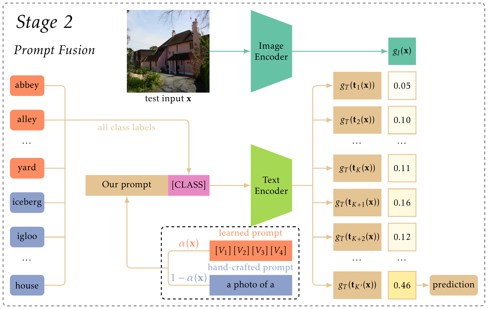

# Adapting Vision-Language Models to Open Classes via Test-Time Prompt Tuning

This is a PyTorch implementation of our PRCV 2024 paper [Adapting Vision-Language Models to Open Classes via Test-Time Prompt Tuning](https://arxiv.org/abs/2408.16486).




## Prerequisites

```shell
conda create -n ttpt -y python=3.9
conda activate ttpt
pip install -r requirements.txt
```

Please refer to <https://github.com/KaiyangZhou/Dassl.pytorch#installation> to install the Dassl.pytorch library.

## Experiments

### Datasets

Please refer to <https://github.com/KaiyangZhou/CoOp/blob/main/DATASETS.md> to prepare the datasets.

### Adaptation from base to new classes

```shell
# zero-shot CLIP
bash run_zsclip.sh

# CoOp
bash run_coop.sh

# CoCoOp
bash run_cocoop.sh

# TTPT (Ours)
bash run_ttpt.sh
```

## Citation

```
@article{gao2024adapting,
  title={Adapting Vision-Language Models to Open Classes via Test-Time Prompt Tuning},
  author={Zhengqing Gao and Xiang Ao and Xu-Yao Zhang and Cheng-Lin Liu},
  journal={arXiv preprint arXiv:2408.16486},
  year={2024}
}
```

## Acknowledgements

Our implementation references the codes in the following repositories:
- [CoOp](https://github.com/KaiyangZhou/CoOp)
- [MaPLe](https://github.com/muzairkhattak/multimodal-prompt-learning)
